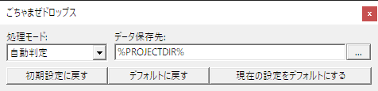

ごちゃまぜドロップス
==============

Copyright (c) 2016 oov.  
MIT license: http://opensource.org/licenses/mit-license.php

これは何か
----------

ごちゃまぜドロップス（ oledd.auf ）は AviUtl の拡張編集へのドラッグ＆ドロップ時の挙動を拡張するための AviUtl プラグインです。

これを導入すると「拡張編集」ウィンドウへのドラッグ＆ドロップ時の挙動が以下のように変化します。

- ブラウザなどから直接画像をドラッグして画像オブジェクトの作成ができるようになる
  - 設定で指定された場所（初期値はデスクトップ）に画像を保存してから読み込みます
  - 同じファイルが既に保存されている場合は再利用されます
- UTF-8 や EUC-JP のテキストファイルでも文字化けせずにテキストオブジェクト作れるようになる
  - テキストファイルを Shift_JIS に変換してから読み込むため、Unicode 特有の文字などは使えません
  - 文字コードの自動判定に失敗した場合は化けます
- [7zip](https://sevenzip.osdn.jp/) で開いた圧縮ファイル内から直接ドラッグ＆ドロップしてファイルを読み込めるようになる
  - ドラッグ＆ドロップでエクスプローラにファイルを作れるソフトなら他のソフトでも対応しているかも
- 複数ファイルを一度にドロップできるようになる
  - 音声とテキストを当時に投げ込んだりできます
- ブラウザやテキストエディタからテキストを選択してドラッグ＆ドロップしてテキストオブジェクトが作れるようになる
  - [字幕アシスト](http://aoytsk.blog.jp/aviutl/1412254.html) の基本機能とほぼ同じですが [exedit][v][vo][a][ao] などには非対応

なお、ごちゃまぜドロップスと[字幕アシスト](http://aoytsk.blog.jp/aviutl/1412254.html)は実装上の都合により同時には使用できません。  
（RegisterDragDrop の呼び出しを乗っ取って両方のプラグインに上手く振り分ければ多分一応動くだろうけども……）

このプログラムについて
----------------------

このプログラムを使用したこと、しなかったことについていかなる保証もしません。

ダウンロード
------------

あとで書く

インストール
------------

oledd.auf を AviUtl と同じ場所に置いてください。

使い方
------

つかんでなげる

設定
----

AviUtl の [表示] メニューから [ごちゃまぜドロップスの表示] を選ぶと、設定用のウィンドウが開きます。  
この設定は aup ファイルに保存されるため、プロジェクトファイルごとに固有の設定ができます。

### 処理モード

ブラウザからの画像ドラッグ＆ドロップなどで持ち込んだデータなど、ドラッグ元の場所などによってはデータが一時ファイルから読み込まれることなどがあります。  
そのようなファイルはドラッグが終わった直後や再起動やキャッシュのクリアなど予期しないタイミングでデータが消されることがあるため、データを長期的に使用する場合はコピーしておかなければなりません。

ここで選択する処理モードによって、ファイルをコピーするかどうかが決定されます。  
それぞれのモードの動作は以下の通りです。  

- 自動判定
  - 読み込むファイルが以下のフォルダの階層以下にある場合のみ、「データ保存先」にコピーしてから読み込まれます。  
  通常はこの設定で使うことを想定しています。
    - CSIDL_APPDATA
    - CSIDL_LOCAL_APPDATA
    - CSIDL_COMMON_APPDATA
    - CSIDL_COOKIES
    - CSIDL_INTERNET_CACHE
    - CSIDL_LOCAL_APPDATA
    - CSIDL_PROGRAM_FILES
    - CSIDL_PROGRAM_FILES_COMMON
    - CSIDL_STARTMENU
    - CSIDL_PROGRAMS
    - CSIDL_WINDOWS
    - CSIDL_SYSTEM
- コピーを作成
  - 常に「データ保存先」にコピーしてから読み込まれます。
- 直接読み込み
  - 常に直接読み込まれます。   
  ただし直接読み込めない場合には「データ保存先」にコピーしてから読み込まれます。

### データ保存先

ドラッグ元がファイルではなかった場合や、上記の「処理モード」でコピーしてから読み込む場合の保存先です。

デフォルト値はデスクトップです。

FAQ
---

- Q. テキストをドロップで投げ込めないソフトがある
  - A. 対応していないソフトもある
- Q. 投げ込むとファイル名の後ろにゴミがつく
  - A. ゴミではない
- Q. 上手くドラッグ＆ドロップできないソフトがある
  - A. そういうソフトもあるだろう
- Q. ドラッグ元やドロップ先のソフトが落ちる
  - A. そういうソフトもあるかも知れない

ソースコード
------------

ごちゃまぜドロップスは [Lazarus](http://www.lazarus-ide.org/) 1.6RC2 で開発しています。  
外部のパッケージなどには依存していないため、インストール直後の状態で oledd.lpi を開けばコンパイルできると思います。

更新履歴
--------

- 2016-02-16
  - 初版
