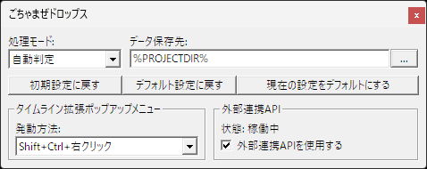

ごちゃまぜドロップス
====================

ごちゃまぜドロップス（ GCMZDrops.auf ）は拡張編集ウィンドウへファイルやテキストをドラッグ＆ドロップした時の挙動を拡張するための AviUtl プラグインです。

これを導入すると拡張編集ウィンドウへのドラッグ＆ドロップ時の挙動が以下のように変化します。

- ブラウザなどから直接画像をドラッグして画像オブジェクトの作成ができるようになる
  - 設定で指定された場所に画像を保存してから読み込みます
  - 同じファイルが既に保存されている場合は再利用されます
- UTF-8 や EUC-JP のテキストファイルを事前に Shift_JIS に変換してから読み込ませられる
  - 文字コードの自動判定に失敗した場合は化けます
- [7zip](https://7-zip.opensource.jp/) で開いた圧縮ファイル内から直接ドラッグ＆ドロップしてファイルを読み込めるようになる
  - ドラッグ＆ドロップでエクスプローラにファイルを作れるソフトなら他のソフトでも対応しているかも
- 複数ファイルを一度にドロップできるようになる
  - 音声とテキストを同時に投げ込んだりできます
  - ただし動画など元々複数レイヤーに配置されることがあるアイテムがあると正常に動きません
- ブラウザやテキストエディタからテキストを選択してドラッグ＆ドロップでテキストオブジェクトが作れる
  - [字幕アシスト](http://aoytsk.blog.jp/aviutl/1412254.html) の基本機能とほぼ同じですが `[exedit]``[v]``[vo]``[a]``[ao]` などには非対応
- Lua スクリプトを書くことによって独自の振る舞いを追加可能
  - スクリプトを記述することによって、特定のファイルがドロップされた時の振る舞いを変更したり、  
  Shift キーを押しながらドロップした時に挙動を変更したりできます
- 拡張編集ウィンドウ上で `Shift + Ctrl + 右クリック` または `中クリック（ホイールクリック）` をすることによって、  
外部からファイルをドラッグで持ち込むのではなく、Lua スクリプトからファイルをドロップ可能
  - 初期状態では「クリップボードから貼り付け」スクリプト `clipboard.lua` が実装されています

なお、ごちゃまぜドロップスと[字幕アシスト](http://aoytsk.blog.jp/aviutl/1412254.html)は実装上の都合により同時には使用できません。

ごちゃまぜドロップスの動作には AviUtl version 1.00 以降と拡張編集 version 0.92 以降が必要です。  
また、Windows 10 より前の OS では以下のランタイムをインストールしなければ動作しない場合があります。

https://aka.ms/vs/17/release/vc_redist.x86.exe

注意事項
--------

ごちゃまぜドロップスは無保証で提供されます。  
ごちゃまぜドロップスを使用したこと及び使用しなかったことによるいかなる損害について、開発者は責任を負いません。

これに同意できない場合、あなたはごちゃまぜドロップスを使用することができません。

ダウンロード
------------

https://github.com/oov/aviutl_gcmzdrops/releases

インストール／アンインストール
------------------------------

GCMZDrops.auf と GCMZDrops フォルダーを **exedit.auf と同じ場所** に置いてください。  
（この1行しか書いてないのに、これを読まずに「動かない」と SNS に助けを求める人が結構居て、こんなにも読まれてないんだなあ……って思いますね）

削除時もそれらを削除するだけで OK です。

設定
----

AviUtl の `表示` メニューから `ごちゃまぜドロップスの表示` を選ぶと、設定用のウィンドウが開きます。  
この設定は AviUtl のプロジェクトファイル(*.aup) に保存されるため、プロジェクトごとに固有の設定ができます。



### 処理モード

ブラウザから画像をドラッグ＆ドロップなどで持ち込んだ場合など、ドラッグ元の場所などによってはデータがファイルとして存在しない場合や、将来的に削除される場所から読み込んでしまう可能性があります。  
そのようなファイルを安全に読み込むために、ごちゃまぜドロップスでは必要に応じてファイルを安全な場所にコピーしてから読み込む場合があります。

ここで選択する処理モードによって、どのような時にファイルをコピーするかが決定されます。  
それぞれのモードの動作は以下の通りです。

- 自動判定
  - 読み込むファイルが以下のフォルダの階層以下にある場合に、「データ保存先」にコピーしてから読み込まれます。  
  通常はこの設定で使うことを想定しています。
    - Temp フォルダ
    - CSIDL_APPDATA
    - CSIDL_LOCAL_APPDATA
    - CSIDL_COMMON_APPDATA
    - CSIDL_COOKIES
    - CSIDL_INTERNET_CACHE
    - CSIDL_LOCAL_APPDATA
    - CSIDL_PROGRAM_FILES
    - CSIDL_PROGRAM_FILES_COMMON
    - CSIDL_STARTMENU
    - CSIDL_PROGRAMS
    - CSIDL_WINDOWS
    - CSIDL_SYSTEM
- コピーを作成
  - 常に「データ保存先」にコピーしてから読み込まれます。
- 直接読み込み
  - なるべく直接読み込みます。

なお、どの動作モードを選んだとしてもドラッグ元がファイルではない場合には「データ保存先」にファイルをコピーしなければならないケースがあります。

### データ保存先

ドラッグ元がファイルではなかった場合や、上記の「処理モード」の選択によりコピーしてから読み込む場合のコピー先になるフォルダーです。

初期値は `%PROJECTDIR%` で、プロジェクトファイルが保存されているフォルダーにファイルを保存します。

なお特別なキーワード `%PROJECTDIR%` を使用する場合は事前にプロジェクトファイルが保存されている必要があり、保存されていない場合はスクリプトなどでエラーが発生します。
また、プロジェクトファイルを別の場所に保存し直しても、以前ドロップしたファイルが自動で移動されることはありません。

### 初期設定に戻す

処理モードを `自動` に、データ保存先を `%PROJECTDIR%` に変更します。

### デフォルトに戻す

処理モードとデータ保存先をデフォルト設定に戻します。

### 現在の設定をデフォルトにする

現在の処理モードとデータ保存先を、新規プロジェクト作成時のデフォルト値に設定します。

例えばデータ保存先を `%PROJECTDIR%\gcmz` などのデフォルト値にすると、プロジェクトファイルの場所が変わるのに合わせて保存先を変えるような使い方ができます。

スクリプトの書き方
------------------

`GCMZDrops` フォルダーの中に `*.lua` ファイルを入れることで、ドロップされたファイルに対して独自の振る舞いを追加することができます。

最も基本的な雛形として参考になるのは `generic.lua` で、ドロップされるファイルを全て受け入れ、そのまま AviUtl に渡すだけのスクリプトです。  
Lua スクリプト内で使えるごちゃまぜドロップス専用の関数などは `example.lua` を参照してください。

また、`dropper` フォルダの中にスクリプトファイルを配置することで、拡張編集ウィンドウ上で `Shift + Ctrl + 右クリック` または `中クリック（ホイールクリック）` をした時にメニューを表示し、ファイルを投げ込むためのスクリプトを記述することが可能です。  
ごちゃまぜドロップスでは通常の場合「拡張編集ウィンドウにファイルなどをドラッグで持ち込んだ時」というのが Lua スクリプトの動作の起点になりますが、この仕組みを使うとファイルを持ち込まなくても動作の起点にすることができます。

外部連携用 API について
-----------------------

外部のアプリケーションから拡張編集の現在のカーソル位置へのファイルドロップを実現するために、実験的な外部連携用 API を提供しています。  
ここで紹介する API は ごちゃまぜドロップス v0.3.12 以降で使用可能です。

この API は試験運用中のため、予告なく変更または削除されることがあります。

```c
#include <stdint.h>
#include <stdio.h>

#define UNICODE
#include <Windows.h>

struct GCMZDropsData {
  uint32_t Window;
  int32_t Width;
  int32_t Height;
  int32_t VideoRate;
  int32_t VideoScale;
  int32_t AudioRate;
  int32_t AudioCh;
  int32_t GCMZAPIVer;
  wchar_t ProjectPath[MAX_PATH];
  uint32_t Flags; // GCMZAPIVer が 2 以上なら存在する
};

int main(){
  HANDLE hMutex = OpenMutex(MUTEX_ALL_ACCESS, FALSE, TEXT("GCMZDropsMutex"));
  if (hMutex == NULL) {
    printf("OpenMutex に失敗しました。\n");
    return 0;
  }

  HANDLE hFMO = OpenFileMapping(FILE_MAP_READ, FALSE, TEXT("GCMZDrops"));
  if (hFMO == NULL) {
    printf("OpenFileMapping に失敗しました。\n");
    goto CloseMutex;
  }

  struct GCMZDropsData *p = MapViewOfFile(hFMO, FILE_MAP_READ, 0, 0, 0);
  if (p == NULL) {
    printf("MapViewOfFile に失敗しました。\n");
    goto CloseFMO;
  }

  WaitForSingleObject(hMutex, INFINITE);

  HWND targetWnd = (HWND)(ULONG_PTR)p->Window;
  if (targetWnd == NULL) {
    printf("対象ウィンドウの取得に失敗しました。\n");
    goto Unmap;
  }

  if (p->Width == 0) {
    printf("プロジェクトが開かれていません。\n");
    goto Unmap;
  }

  // v0.3.23 以降なら 2
  // v0.3.12 以降なら 1
  printf("GCMZAPIVer: %d\n", p->GCMZAPIVer);

  printf("ProjectPath(%d): %ls\n", (int)wcslen(p->ProjectPath), p->ProjectPath);
  printf("Window: %d\n", p->Window);
  printf("Width: %d\n", p->Width);
  printf("Height: %d\n", p->Height);
  printf("VideoRate: %d\n", p->VideoRate);
  printf("VideoScale: %d\n", p->VideoScale);
  printf("AudioRate: %d\n", p->AudioRate);
  printf("AudioCh: %d\n", p->AudioCh);

  // GCMZAPIVer が 2 以上なら Flags が存在する
  if (p->GCMZAPIVer >= 2) {
    printf("Flags: %d\n", (int)p->Flags);
    if (p->Flags & 1) {
      // 英語化パッチが当たっている拡張編集だった
      printf("  English Patched\n");
    }
    if (p->Flags & 2) {
      // 中国語簡体字パッチが当たっている拡張編集だった
      printf("  Simplified Chinese Patched\n");
    }
  }

  // GCMZAPIVer が 0 のときは対応しない　※API 仕様が異なります
  if (p->GCMZAPIVer == 0) {
    printf("GCMZDrops too old, please update to v0.3.12 or later.");
    goto Unmap;
  }

  HWND myWnd = GetConsoleWindow();

  COPYDATASTRUCT cds;

  // 必ず 1 を指定してください。
  cds.dwData = 1;

  // JSON を UTF-8 エンコーディングで渡します。
  // layer:
  //   ドロップするレイヤーを決めます。
  //   指定を省略することはできません。
  //   -1 ～ -100
  //       拡張編集上での現在の表示位置からの相対位置へ挿入
  //       例: 縦スクロールによって一番上に見えるレイヤーが Layer 3 のとき、-1 を指定すると Layer 3、-2 を指定すると Layer 4 へ挿入
  //    1 ～  100
  //       スクロール位置に関わらず指定したレイヤー番号へ挿入
  // frameAdvance:
  //   ファイルのドロップした後、指定されたフレーム数だけカーソルを先に進めます。
  //   進める必要がない場合は省略可能です。
  // files:
  //   投げ込むファイルへのフルパスを配列で渡します。
  //   ファイル名は UTF-8 にする必要がありますが、拡張編集の仕様上 ShiftJIS の範囲内の文字しか扱えません。
  cds.lpData = u8"{\"layer\":-1,\"frameAdvance\":12,\"files\":[\"C:\\\\test.bmp\"]}";
  cds.cbData = strlen(cds.lpData);

  // API を呼び出します
  //   cds.dwData の値が間違っている場合や JSON がおかしい場合など、
  //   API としての送信フォーマットに問題がある場合には OutputDebugString でエラーメッセージを出力します。
  //   ドロップするファイルが見つからないなど、ファイルの内容に問題がある場合はメッセージボックスで表示します。
  SendMessage(targetWnd, WM_COPYDATA, (WPARAM)myWnd, (LPARAM)&cds);

Unmap:
  ReleaseMutex(hMutex);

  if (UnmapViewOfFile(p) == 0) {
    printf("UnmapViewOfVile に失敗しました。\n");
    goto CloseFMO;
  }

CloseFMO:
  CloseHandle(hFMO);
CloseMutex:
  CloseHandle(hMutex);
  return 0;
}
```

この API を使用する上での一般的な注意事項は以下の通りです。

- **拡張編集ウィンドウについて**  
拡張編集ウィンドウが表示されていないとアイテムの挿入位置を判定できずに API の実行に失敗することがあります。  
また、レイヤーの高さやタイムラインの表示倍率などの検出に失敗した場合はカレントディレクトリに `gcmz-apierr-20191231-235959.bmp` のようなファイル名で失敗時の画像を保存します。
- **挿入位置について**  
挿入先に既にオブジェクトがある場合など、十分なスペースがない場合は想定した場所に挿入されません。
- **複数ファイルのドロップについて**  
一応対応していますが、十分なスペースがない場合は一部のファイルだけがずれた位置に配置されます。  
また、動画や `*.exo` ファイルのようにタイムラインに複数行挿入されるアイテムがある場合、それ以降は正しい位置に挿入されません。
- **タイムラインの表示倍率について**  
正しい位置にファイルをドロップするためには拡張編集のタイムラインを一定以上の拡大率にする必要があるため、条件を満たしていない場合は一時的にタイムラインが拡大されます。
- **多重起動について**  
API が使えるのは最初に起動したインスタンスのみで、AviUtl を多重起動しても２つ目以降では API は無効状態になり、その旨を伝えるエラーダイアログが表示されます。

FAQ
---

- Q. テキストをドロップで投げ込めないソフトがある
  - A. 対応していないソフトもある
- Q. 投げ込むとファイル名の後ろにゴミがつく
  - A. ゴミではない
- Q. 上手くドラッグ＆ドロップできないソフトがある
  - A. そういうソフトもあるだろう
- Q. ドラッグ元やドロップ先のソフトが落ちる
  - A. そういうソフトもあるかも知れない
- Q. エラーが出る
  - A. エラー内容と、AviUtl / 拡張編集 / ごちゃまぜドロップスのバージョンと、  
       ごちゃまぜドロップスの最新版でも起こるかどうかを教えて下さい
  - A. 拡張編集の UI の色を変えるようなプラグインとは競合する可能性があります  
       もし変えている場合は戻してみてください
- Q. 「AviUtl で使用できない文字がファイル名に含まれています」というエラーが出る
  - A. これは AviUtl で使用できない文字がファイル名に含まれているのが原因でエラーが出ています。
       ごちゃまぜドロップスが扱えないのではなく、AviUtl や拡張編集で扱えないという話です。
       ごちゃまぜドロップスを消せばエラーメッセージは出ませんが、ファイルは読み込めません。
       つまり単なる親切心で読み込み前にチェックし、問題がある場合に理由を通知しているだけです。
       問題がある文字がなくなるようにファイル名を変えれば読み込めるようになります。

バイナリのビルドについて
------------------------

ごちゃまぜドロップスは [MSYS2](https://www.msys2.org/) + CLANG32 上で開発しています。  
ビルド方法や必要になるパッケージなどは [GitHub Actions の設定ファイル](https://github.com/oov/aviutl_gcmzdrops/blob/main/.github/workflows/releaser.yml) を参考にしてください。

Contributors
------------

- Nsyw

Credits
-------

ごちゃまぜドロップス is made possible by the following open source softwares.

### Acutest

https://github.com/mity/acutest

The MIT License (MIT)

Copyright © 2013-2019 Martin Mitáš

Permission is hereby granted, free of charge, to any person obtaining a
copy of this software and associated documentation files (the “Software”),
to deal in the Software without restriction, including without limitation
the rights to use, copy, modify, merge, publish, distribute, sublicense,
and/or sell copies of the Software, and to permit persons to whom the
Software is furnished to do so, subject to the following conditions:

The above copyright notice and this permission notice shall be included
in all copies or substantial portions of the Software.

THE SOFTWARE IS PROVIDED “AS IS”, WITHOUT WARRANTY OF ANY KIND, EXPRESS
OR IMPLIED, INCLUDING BUT NOT LIMITED TO THE WARRANTIES OF MERCHANTABILITY,
FITNESS FOR A PARTICULAR PURPOSE AND NONINFRINGEMENT. IN NO EVENT SHALL
THE AUTHORS OR COPYRIGHT HOLDERS BE LIABLE FOR ANY CLAIM, DAMAGES OR OTHER
LIABILITY, WHETHER IN AN ACTION OF CONTRACT, TORT OR OTHERWISE, ARISING
FROM, OUT OF OR IN CONNECTION WITH THE SOFTWARE OR THE USE OR OTHER DEALINGS
IN THE SOFTWARE.

### AviUtl Plugin SDK

http://spring-fragrance.mints.ne.jp/aviutl/

The MIT License

Copyright (c) 1999-2012 Kenkun

Permission is hereby granted, free of charge, to any person obtaining a copy
of this software and associated documentation files (the "Software"), to deal
in the Software without restriction, including without limitation the rights
to use, copy, modify, merge, publish, distribute, sublicense, and/or sell
copies of the Software, and to permit persons to whom the Software is
furnished to do so, subject to the following conditions:

The above copyright notice and this permission notice shall be included in
all copies or substantial portions of the Software.

THE SOFTWARE IS PROVIDED "AS IS", WITHOUT WARRANTY OF ANY KIND, EXPRESS OR
IMPLIED, INCLUDING BUT NOT LIMITED TO THE WARRANTIES OF MERCHANTABILITY,
FITNESS FOR A PARTICULAR PURPOSE AND NONINFRINGEMENT. IN NO EVENT SHALL THE
AUTHORS OR COPYRIGHT HOLDERS BE LIABLE FOR ANY CLAIM, DAMAGES OR OTHER
LIABILITY, WHETHER IN AN ACTION OF CONTRACT, TORT OR OTHERWISE, ARISING FROM,
OUT OF OR IN CONNECTION WITH THE SOFTWARE OR THE USE OR OTHER DEALINGS IN
THE SOFTWARE.

### crc64.c

https://github.com/redis/redis/blob/2.6/src/crc64.c

Copyright (c) 2012, Salvatore Sanfilippo <antirez at gmail dot com>
All rights reserved.

Redistribution and use in source and binary forms, with or without
modification, are permitted provided that the following conditions are met:

  * Redistributions of source code must retain the above copyright notice,
    this list of conditions and the following disclaimer.
  * Redistributions in binary form must reproduce the above copyright
    notice, this list of conditions and the following disclaimer in the
    documentation and/or other materials provided with the distribution.
  * Neither the name of Redis nor the names of its contributors may be used
    to endorse or promote products derived from this software without
    specific prior written permission.

THIS SOFTWARE IS PROVIDED BY THE COPYRIGHT HOLDERS AND CONTRIBUTORS "AS IS"
AND ANY EXPRESS OR IMPLIED WARRANTIES, INCLUDING, BUT NOT LIMITED TO, THE
IMPLIED WARRANTIES OF MERCHANTABILITY AND FITNESS FOR A PARTICULAR PURPOSE
ARE DISCLAIMED. IN NO EVENT SHALL THE COPYRIGHT OWNER OR CONTRIBUTORS BE
LIABLE FOR ANY DIRECT, INDIRECT, INCIDENTAL, SPECIAL, EXEMPLARY, OR
CONSEQUENTIAL DAMAGES (INCLUDING, BUT NOT LIMITED TO, PROCUREMENT OF
SUBSTITUTE GOODS OR SERVICES; LOSS OF USE, DATA, OR PROFITS; OR BUSINESS
INTERRUPTION) HOWEVER CAUSED AND ON ANY THEORY OF LIABILITY, WHETHER IN
CONTRACT, STRICT LIABILITY, OR TORT (INCLUDING NEGLIGENCE OR OTHERWISE)
ARISING IN ANY WAY OUT OF THE USE OF THIS SOFTWARE, EVEN IF ADVISED OF THE
POSSIBILITY OF SUCH DAMAGE.

### detect.c

https://github.com/monochromegane/the_platinum_searcher

The MIT License (MIT)

Copyright (c) [2014] [the_platinum_searcher]

Permission is hereby granted, free of charge, to any person obtaining a copy
of this software and associated documentation files (the "Software"), to deal
in the Software without restriction, including without limitation the rights
to use, copy, modify, merge, publish, distribute, sublicense, and/or sell
copies of the Software, and to permit persons to whom the Software is
furnished to do so, subject to the following conditions:

The above copyright notice and this permission notice shall be included in all
copies or substantial portions of the Software.

THE SOFTWARE IS PROVIDED "AS IS", WITHOUT WARRANTY OF ANY KIND, EXPRESS OR
IMPLIED, INCLUDING BUT NOT LIMITED TO THE WARRANTIES OF MERCHANTABILITY,
FITNESS FOR A PARTICULAR PURPOSE AND NONINFRINGEMENT. IN NO EVENT SHALL THE
AUTHORS OR COPYRIGHT HOLDERS BE LIABLE FOR ANY CLAIM, DAMAGES OR OTHER
LIABILITY, WHETHER IN AN ACTION OF CONTRACT, TORT OR OTHERWISE, ARISING FROM,
OUT OF OR IN CONNECTION WITH THE SOFTWARE OR THE USE OR OTHER DEALINGS IN THE
SOFTWARE.

### hashmap.c

https://github.com/tidwall/hashmap.c

NOTICE: This program used a modified version of hashmap.c.  
        https://github.com/oov/hashmap.c/tree/simplify

The MIT License (MIT)

Copyright (c) 2020 Joshua J Baker

Permission is hereby granted, free of charge, to any person obtaining a copy of
this software and associated documentation files (the "Software"), to deal in
the Software without restriction, including without limitation the rights to
use, copy, modify, merge, publish, distribute, sublicense, and/or sell copies of
the Software, and to permit persons to whom the Software is furnished to do so,
subject to the following conditions:

The above copyright notice and this permission notice shall be included in all
copies or substantial portions of the Software.

THE SOFTWARE IS PROVIDED "AS IS", WITHOUT WARRANTY OF ANY KIND, EXPRESS OR
IMPLIED, INCLUDING BUT NOT LIMITED TO THE WARRANTIES OF MERCHANTABILITY, FITNESS
FOR A PARTICULAR PURPOSE AND NONINFRINGEMENT. IN NO EVENT SHALL THE AUTHORS OR
COPYRIGHT HOLDERS BE LIABLE FOR ANY CLAIM, DAMAGES OR OTHER LIABILITY, WHETHER
IN AN ACTION OF CONTRACT, TORT OR OTHERWISE, ARISING FROM, OUT OF OR IN
CONNECTION WITH THE SOFTWARE OR THE USE OR OTHER DEALINGS IN THE SOFTWARE.

### Jansson

https://github.com/akheron/jansson

Copyright (c) 2009-2020 Petri Lehtinen <petri@digip.org>

Permission is hereby granted, free of charge, to any person obtaining a copy
of this software and associated documentation files (the "Software"), to deal
in the Software without restriction, including without limitation the rights
to use, copy, modify, merge, publish, distribute, sublicense, and/or sell
copies of the Software, and to permit persons to whom the Software is
furnished to do so, subject to the following conditions:

The above copyright notice and this permission notice shall be included in
all copies or substantial portions of the Software.

THE SOFTWARE IS PROVIDED "AS IS", WITHOUT WARRANTY OF ANY KIND, EXPRESS OR
IMPLIED, INCLUDING BUT NOT LIMITED TO THE WARRANTIES OF MERCHANTABILITY,
FITNESS FOR A PARTICULAR PURPOSE AND NONINFRINGEMENT. IN NO EVENT SHALL THE
AUTHORS OR COPYRIGHT HOLDERS BE LIABLE FOR ANY CLAIM, DAMAGES OR OTHER
LIABILITY, WHETHER IN AN ACTION OF CONTRACT, TORT OR OTHERWISE, ARISING FROM,
OUT OF OR IN CONNECTION WITH THE SOFTWARE OR THE USE OR OTHER DEALINGS IN
THE SOFTWARE.

### Lua

http://www.lua.org/

Copyright (C) 1994-2003 Tecgraf, PUC-Rio.  All rights reserved.

Permission is hereby granted, free of charge, to any person obtaining
a copy of this software and associated documentation files (the
"Software"), to deal in the Software without restriction, including
without limitation the rights to use, copy, modify, merge, publish,
distribute, sublicense, and/or sell copies of the Software, and to
permit persons to whom the Software is furnished to do so, subject to
the following conditions:

The above copyright notice and this permission notice shall be
included in all copies or substantial portions of the Software.

THE SOFTWARE IS PROVIDED "AS IS", WITHOUT WARRANTY OF ANY KIND,
EXPRESS OR IMPLIED, INCLUDING BUT NOT LIMITED TO THE WARRANTIES OF
MERCHANTABILITY, FITNESS FOR A PARTICULAR PURPOSE AND NONINFRINGEMENT.
IN NO EVENT SHALL THE AUTHORS OR COPYRIGHT HOLDERS BE LIABLE FOR ANY
CLAIM, DAMAGES OR OTHER LIABILITY, WHETHER IN AN ACTION OF CONTRACT,
TORT OR OTHERWISE, ARISING FROM, OUT OF OR IN CONNECTION WITH THE
SOFTWARE OR THE USE OR OTHER DEALINGS IN THE SOFTWARE.

### stb_image.h

https://github.com/nothings/stb

Public Domain (www.unlicense.org)

This is free and unencumbered software released into the public domain.
Anyone is free to copy, modify, publish, use, compile, sell, or distribute this
software, either in source code form or as a compiled binary, for any purpose,
commercial or non-commercial, and by any means.
In jurisdictions that recognize copyright laws, the author or authors of this
software dedicate any and all copyright interest in the software to the public
domain. We make this dedication for the benefit of the public at large and to
the detriment of our heirs and successors. We intend this dedication to be an
overt act of relinquishment in perpetuity of all present and future rights to
this software under copyright law.
THE SOFTWARE IS PROVIDED "AS IS", WITHOUT WARRANTY OF ANY KIND, EXPRESS OR
IMPLIED, INCLUDING BUT NOT LIMITED TO THE WARRANTIES OF MERCHANTABILITY,
FITNESS FOR A PARTICULAR PURPOSE AND NONINFRINGEMENT. IN NO EVENT SHALL THE
AUTHORS BE LIABLE FOR ANY CLAIM, DAMAGES OR OTHER LIABILITY, WHETHER IN AN
ACTION OF CONTRACT, TORT OR OTHERWISE, ARISING FROM, OUT OF OR IN CONNECTION
WITH THE SOFTWARE OR THE USE OR OTHER DEALINGS IN THE SOFTWARE.

### TinyCThread

https://github.com/tinycthread/tinycthread

NOTICE: This program used a modified version of TinyCThread.  
        https://github.com/oov/tinycthread

Copyright (c) 2012 Marcus Geelnard
              2013-2016 Evan Nemerson

This software is provided 'as-is', without any express or implied
warranty. In no event will the authors be held liable for any damages
arising from the use of this software.

Permission is granted to anyone to use this software for any purpose,
including commercial applications, and to alter it and redistribute it
freely, subject to the following restrictions:

    1. The origin of this software must not be misrepresented; you must not
    claim that you wrote the original software. If you use this software
    in a product, an acknowledgment in the product documentation would be
    appreciated but is not required.

    2. Altered source versions must be plainly marked as such, and must not be
    misrepresented as being the original software.

    3. This notice may not be removed or altered from any source
    distribution.
